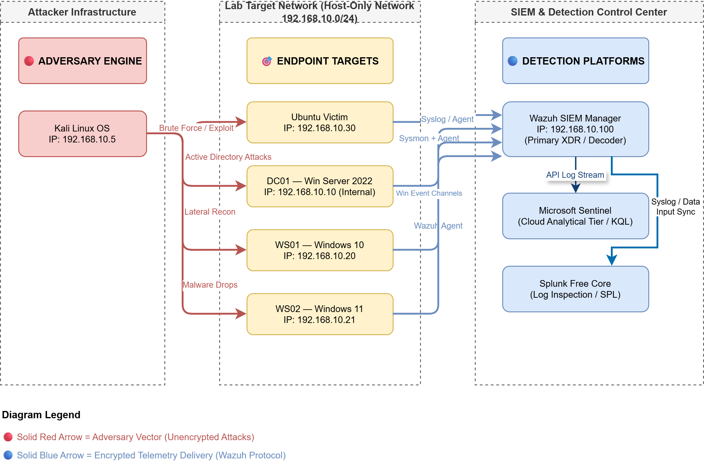

# 🛡️ SOC Incident Lab — Blue Team Home Lab Portfolio

> A hands-on SOC analyst portfolio built from scratch. Real attacks. Real detection. Real documentation.

---

## 🔭 What This Is

This is not a tutorial-following exercise. This is a professional-grade SOC home lab where I simulate real attacks, detect them across multiple SIEM platforms, write custom detection rules, and document everything in NIST Incident Response format.

Built by a BTech student at NIT Hamirpur who is actively transitioning into cybersecurity — starting with blue team and SOC operations.

---

## 🏗️ Lab Architecture

**Environment Overview:**

| Machine | OS | Role | IP |
|---|---|---|---|
| Kali-Attacker | Kali Linux | Attacker | 192.168.10.5 |
| Ubuntu-Victim | Ubuntu Server 22.04 | Linux Target | 192.168.10.30 |
| DC01-Server | Windows Server 2022 | Domain Controller (SOC.LAB) | 192.168.10.10 |
| WS01-Client | Windows 10 | Domain Workstation 1 | 192.168.10.20 |
| WS02-Client | Windows 11 | Domain Workstation 2 | 192.168.10.21 |
| Wazuh-SIEM | Ubuntu Server 22.04 | SIEM / XDR | 192.168.10.100 |

## 🏗️ Lab Architecture



**Active Directory Domain:** `SOC.LAB`

---

## ⚙️ SIEM Platforms Used

| Platform | Purpose |
|---|---|
| **Wazuh 4.7** | Primary SIEM + XDR + Active Response |
| **Microsoft Sentinel** | Cloud SIEM — KQL queries and workbooks |
| **Splunk Free** | Log analysis + SPL queries |

---

## 🔍 Investigation Index

### Active Directory Attacks

| # | Investigation | MITRE Technique | Status |
|---|---|---|---|
| AD-01 | [AD Enumeration — BloodHound & LDAP Recon](./ActiveDirectory/Incident-AD-01-Enumeration/) | T1069.002, T1087.002 | 🔄 In Progress |
| AD-02 | [Kerberoasting Attack + Detection](./ActiveDirectory/Incident-AD-02-Kerberoasting/) | T1558.003 | 🔄 In Progress |
| AD-03 | [AS-REP Roasting](./ActiveDirectory/Incident-AD-03-ASREPRoasting/) | T1558.004 | ⏳ Upcoming |
| AD-04 | [Pass-the-Hash + Lateral Movement](./ActiveDirectory/Incident-AD-04-PassTheHash/) | T1550.002 | ⏳ Upcoming |
| AD-KC | [Full AD Kill Chain Report](./ActiveDirectory/Incident-AD-KillChain/) | Multiple | ⏳ Upcoming |

### Linux Incident Investigations

| # | Investigation | MITRE Technique | Status |
|---|---|---|---|
| 01 | [Port Scan Detection](./Linux-Incidents/Incident-01-PortScan/) | T1046 | ⏳ Upcoming |
| 02 | [SSH Brute Force](./Linux-Incidents/Incident-02-SSHBruteForce/) | T1110.001 | ⏳ Upcoming |
| 03 | [Web Directory Enumeration](./Linux-Incidents/Incident-03-WebEnumeration/) | T1083 | ⏳ Upcoming |
| 04 | [Web Vulnerability Scan](./Linux-Incidents/Incident-04-WebVulnScan/) | T1595.002 | ⏳ Upcoming |
| 05 | [Reverse Shell Attack](./Linux-Incidents/Incident-05-ReverseShell/) | T1059.004 | ⏳ Upcoming |
| 06 | [Credential Sniffing](./Linux-Incidents/Incident-06-CredSniffing/) | T1040 | ⏳ Upcoming |
| 07 | [Privilege Escalation — SUID/Cron](./Linux-Incidents/Incident-07-PrivEsc/) | T1548.001, T1053.003 | ⏳ Upcoming |
| 08 | [Data Exfiltration](./Linux-Incidents/Incident-08-DataExfil/) | T1048, T1041 | ⏳ Upcoming |

### Threat Hunting

| # | Exercise | APT Group | Status |
|---|---|---|---|
| TH-01 | [APT Simulation — TTP Hunt](./ThreatHunting/) | APT29 / Lazarus | ⏳ Upcoming |

---

## 🛠️ Skills Demonstrated

| Category | Skills |
|---|---|
| **SIEM** | Wazuh, Microsoft Sentinel, Splunk |
| **Query Languages** | KQL (Sentinel), SPL (Splunk), Wazuh rules |
| **Detection Engineering** | Sigma rules, YARA rules, custom Wazuh rules |
| **Network Analysis** | Wireshark, tcpdump, pcap analysis |
| **Active Directory** | AD attacks, GPO, Kerberos, BloodHound |
| **Attack Tools** | Nmap, Hydra, Gobuster, Nikto, Metasploit, Impacket |
| **Frameworks** | MITRE ATT&CK, NIST Incident Response |
| **Scripting** | Python (IOC enrichment, alert notifier), Bash |
| **Threat Intelligence** | VirusTotal API, AbuseIPDB API |

---

## 📁 Repository Structure

```
SOC-Incident-Lab/
├── README.md
├── Architecture/
│   ├── Lab-Diagram.png          # Full lab topology diagram
│   └── mitre-navigator-layer.json
├── ActiveDirectory/
│   ├── Incident-AD-01-Enumeration/
│   ├── Incident-AD-02-Kerberoasting/
│   ├── Incident-AD-03-ASREPRoasting/
│   ├── Incident-AD-04-PassTheHash/
│   └── Incident-AD-KillChain/
├── Linux-Incidents/
│   ├── Incident-01-PortScan/
│   ├── Incident-02-SSHBruteForce/
│   ├── Incident-03-WebEnumeration/
│   ├── Incident-04-WebVulnScan/
│   ├── Incident-05-ReverseShell/
│   ├── Incident-06-CredSniffing/
│   ├── Incident-07-PrivEsc/
│   └── Incident-08-DataExfil/
├── ThreatHunting/
├── rules/
│   ├── sigma/
│   │   ├── linux/
│   │   └── ad/
│   ├── yara/
│   └── wazuh/
└── scripts/
    ├── ioc_enrichment.py
    ├── alert_notifier.py
    ├── noise_generator.sh
    └── kql-queries.txt
```

---

## 📋 Incident Report Format

Every investigation is documented using the **NIST IR Framework**:

1. Executive Summary
2. Timeline of Events
3. Attack Methodology (MITRE ATT&CK)
4. Log Evidence
5. Network Evidence (pcap analysis)
6. IOC Table
7. Root Cause
8. Impact Assessment
9. Recommendations
10. Lessons Learned

---

## 🎯 MITRE ATT&CK Coverage

> *(MITRE ATT&CK Navigator layer will be added on completion)*

Techniques covered across all investigations:

`T1046` `T1110.001` `T1083` `T1595.002` `T1059.004` `T1071` `T1040` `T1548.001` `T1053.003` `T1048` `T1041` `T1069.002` `T1087.002` `T1558.003` `T1558.004` `T1550.002` `T1021.002` `T1059.001` `T1078`

---

## 🔧 Tools & Resources

| Category | Tool | Purpose |
|---|---|---|
| SIEM | Wazuh 4.7 | Primary SIEM + XDR + active response |
| SIEM | Microsoft Sentinel | Cloud SIEM + KQL queries |
| SIEM | Splunk Free | Log analysis + SPL queries |
| Network | Wireshark | Packet capture and analysis |
| Attack | Nmap | Port scanning |
| Attack | Hydra | Brute force attacks |
| Attack | Gobuster | Web directory enumeration |
| Attack | Metasploit | Exploitation framework |
| Attack | Impacket | AD attack toolkit |
| AD | BloodHound | AD attack path mapping |
| Detection | Sigma | Universal detection rule format |
| Detection | YARA | File and pattern-based detection |
| Intel | VirusTotal API | IP/hash reputation |
| Intel | AbuseIPDB API | IP abuse lookup |
| Framework | MITRE ATT&CK | TTP mapping |
| Diagram | draw.io | Architecture diagrams |

---

## 👤 About Me

BTech student (Electrical Engineering) at **NIT Hamirpur**, actively building skills for a career in cybersecurity — starting with blue team / SOC operations.

- 📜 Google Cybersecurity Certificate (Coursera)
- 🔐 TryHackMe SOC Level 1 (in progress)
- 🎯 Target role: SOC Analyst Internship in India

📬 Connect with me on [LinkedIn] (https://www.linkedin.com/in/shakshi-sona-84a398324/)

---

*This lab is actively being built. New investigations and detection rules are added regularly.*
